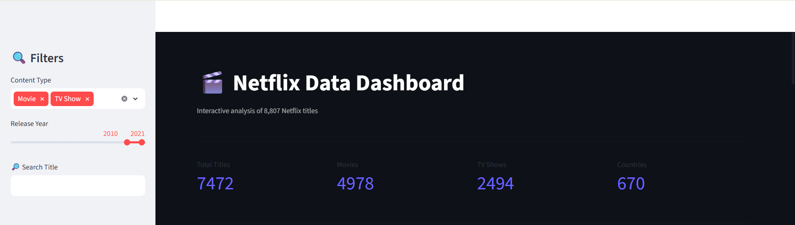
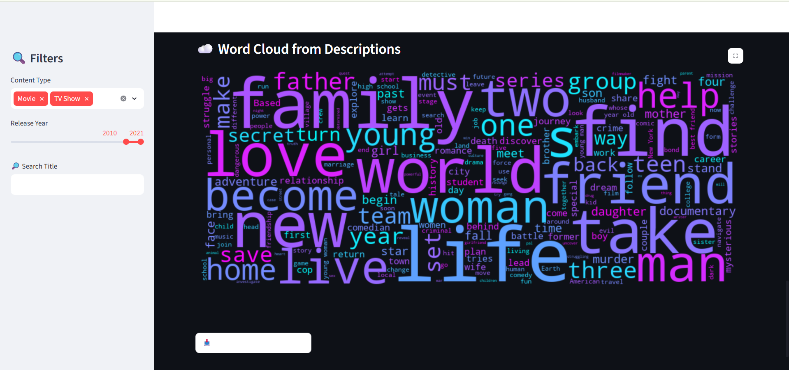

# Netflix Data Analysis & Interactive Dashboard

Exploratory Data Analysis and an interactive Streamlit dashboard built on the Netflix Movies and TV Shows dataset (8,807 titles).

## Overview

This project analyzes Netflix's content library to uncover patterns in content type, geography, genres, ratings, and release trends. It includes both a Jupyter Notebook for EDA and a fully interactive Streamlit + Plotly dashboard.

## Dataset

- **Source:** [Netflix Movies and TV Shows — Kaggle](https://www.kaggle.com/datasets/shivamb/netflix-shows)
- **Size:** 8,807 rows, 12 columns
- **Fields:** show_id, type, title, director, cast, country, date_added, release_year, rating, duration, listed_in, description

## Tech Stack

- **Python**
- **Pandas** & **NumPy** — data cleaning and manipulation
- **Matplotlib** — static EDA visualizations
- **Plotly** — interactive charts
- **Streamlit** — dashboard web app
- **WordCloud** — text analysis on descriptions

  ## Project Highlights

- Analyzed 8,807 Netflix titles
- Built an end-to-end EDA workflow
- Developed an interactive Streamlit dashboard
- Implemented dynamic filtering and search
- Created multiple Plotly visualizations
- Generated text insights using WordCloud

## Key Insights

- Movies make up **69.6%** of Netflix's catalog vs. **30.4%** TV Shows
- The **United States** leads content production, followed by **India** as the second-largest contributor
- **International Movies**, **Dramas**, and **Comedies** are the top three genres
- Content additions peaked in **2018**, followed by a decline during 2020-2021
- **TV-MA** is the most common content rating, indicating a focus on mature audiences
- Description text analysis shows recurring themes around **family**, **love**, and **life**

## Project Structure

```
├── Netflix_Analysis.ipynb     # EDA notebook
├── dash2.py                   # Streamlit dashboard
├── netflix_titles.csv         # Dataset
└── README.md
```

## Dashboard Features

- Sidebar filters: content type, release year range, title search
- Live metric cards (total titles, movies, TV shows, countries)
- Tabbed layout: Overview, Geography, Ratings & Duration
- Interactive Plotly charts: pie, bar, treemap, area, histogram
- Top directors and actors breakdown
- Word cloud generated from title descriptions
- CSV export of filtered data

## Running the Project

**Notebook:**
```bash
jupyter notebook Netflix_Analysis.ipynb
```

**Dashboard:**
```bash
pip install streamlit pandas plotly wordcloud matplotlib
streamlit run app.py
```

Then open `http://localhost:8501` in your browser.
## Dashboard Preview

### Main Dashboard


### Genre Analysis


### Content Explorer


### Actors & Directors Analysis


### Charts & Trends


### Word Cloud


## Future Improvements

- Deploy dashboard on Streamlit Cloud
- Add recommendation engine
- Add advanced filtering options
- Add country-wise interactive maps
- Add trend forecasting

## Author

**Gaurav Sharma**

GitHub: `gaurav2026-gt`

